 # La Teraanga

 La Teraanga is a family food-truck that operates in Worcestershire county and speciliased in Mediterranean cuisine. The greater area of Worcestershire hasn't enough options of Mediterranean restaurants so by moving from town to town can offer something different to the people of each town.

 Welcome to <a href="https://theodorchris.github.io/La-Teraanga/" target="_blank" rel="noopener">La Teraanga!</a>

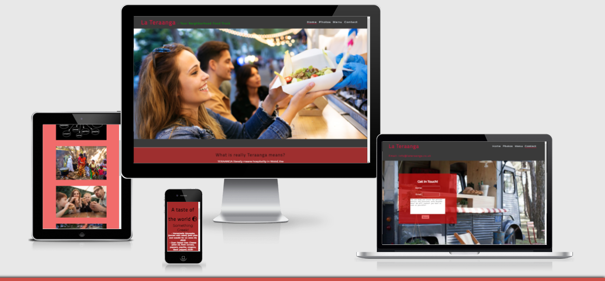

 # Features
 * Home Page
    * Navigation-Menu
      * Sited at the top of all the pages in the site, it is fully responsive and contains links to all the pages of the site to enable ease of navigation in one convenient location.
      * The logo is clickable with a link back to the home page.
      * The other navgiation links are on the left side and clearly tells the user what this page is it for.
  

    * The Header
      * The Header has the logo on the left and the navigation links on the right. It has also a warm color welcome text that appears after the animation of the picture.

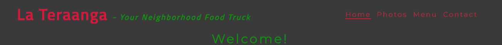

  * Teraanga
      * This section explains what teraanga means and gives an idea of what the people behind the business represent.

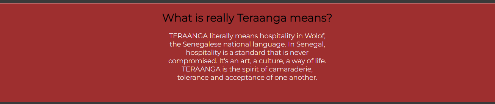

 * Meeting Points
     * This section has the day, the times and the places that the business operate. The colors used in a contrast to help the user have the information easy and clear.

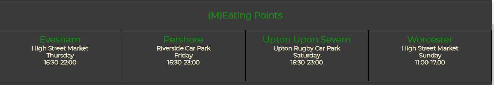

* Footer 
    * On the footer of the page and every page there are the social media used font-icons.

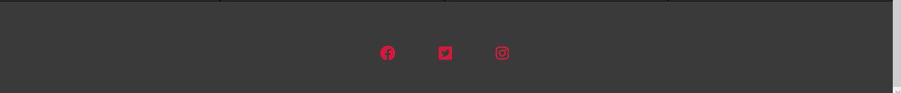

* Photos 

   * The photos page contains images that show people having a good time with a meal.

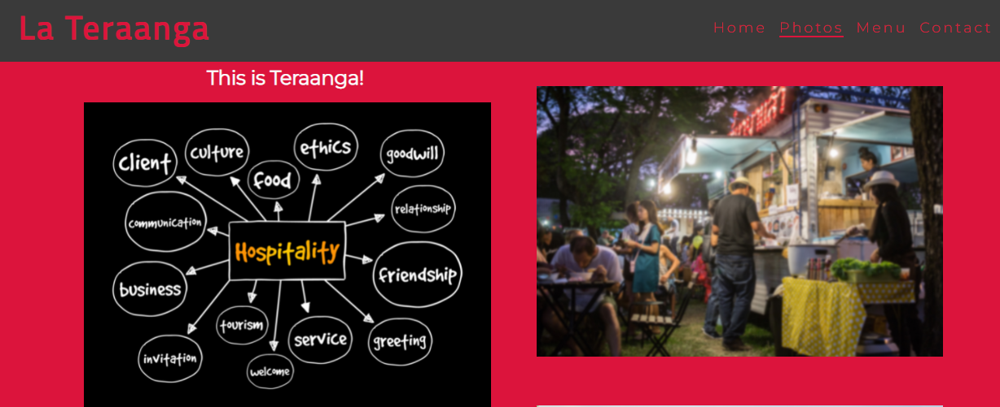

* Menu 
  
   * The menu page clearly indicates that the cuisine is a fusion of the world. I have used contrast colors to make the navigation easier to the user.

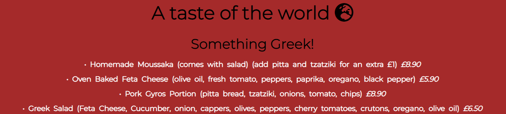

* Contact us 

  * On this page i have a food truck backround image, the contact email on the top left after the logo and a form for enquiries that the user can find useful if there is a reason for hiring the business for private functions.

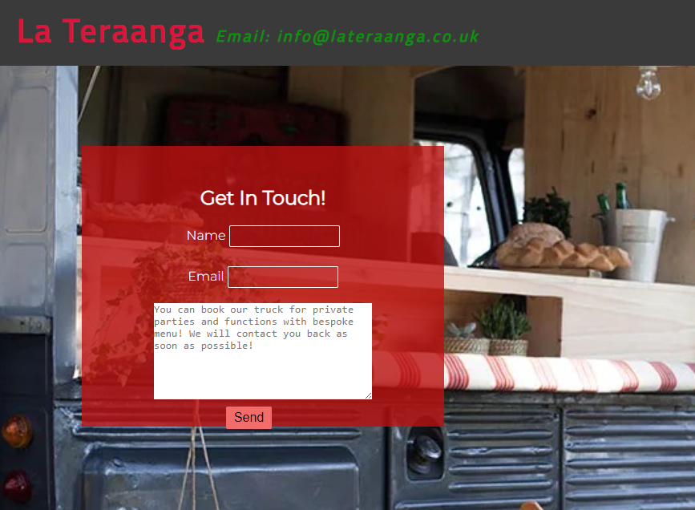

# Testing

  * I tested that this page works with chrome, opera and safari
  * I tested the responsiveness on smaller screen sizes through google tools and it works
  * I have checked that the form works, however since it is a study project i haven't give an action or method. 

# Validation 
 * All the code has been run through the [W3C html Validator](https://validator.w3.org/) and the [W3C CSS Validator](https://jigsaw.w3.org/css-validator/). Minor errors were found on the home and contact pages. After a fix and retest, no errors were returned for both. 

  
The HTML validator results for each page are below:

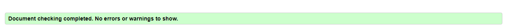

The CSS validator results are below:

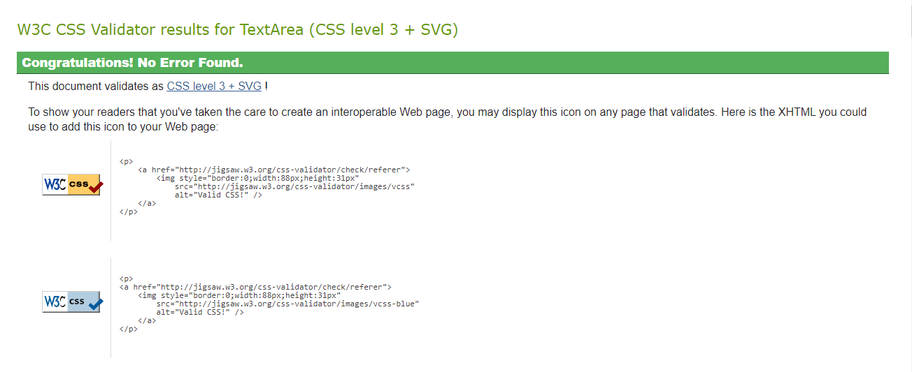

# Accessibility
 * There was an issue with performance on the home page due to large image, i redownload a smaller version and worked much better. The colors and the fonts chosen to be easy readable and make the navigation for the user easier.
 (The image below was taken from a mobile device as at the time google chrome was not respondind)

 The CSS validator results are below:

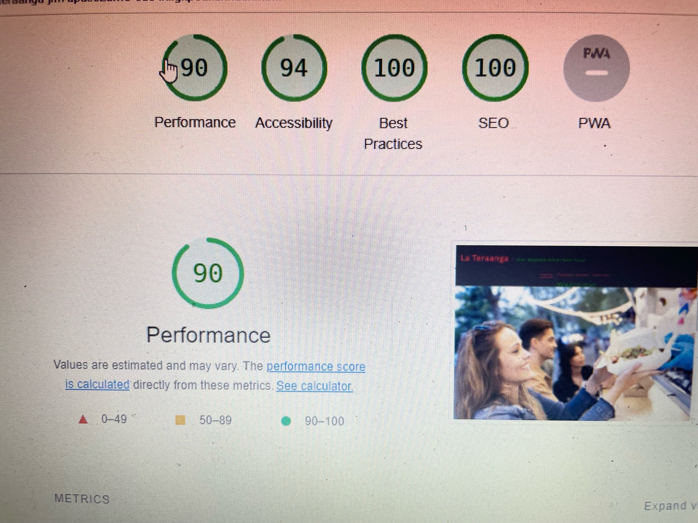

# Bugs

 * While working i had few times non responsiveness screens specially from 500px and down. I addressed it from the beggining so i can have a better understanding on the dimensions. There are no unfixed bugs.

# Deployment

 * The site was deployed to GitHub pages.

# Credits

* The font came from [Google Fonts](https://fonts.google.com/).
* The icons came from [Font Awesome](https://fontawesome.com/).
* The code on the footer for the social media came from the Love Running project.
* The photos came from shutterstock images.
* The README.md file was inspired from the [Code Institute](https://codeinstitute.net/) and from the [Wawaswoods project](https://github.com/EwanColquhoun/wawaswoods)

# Acknowledgements
The site was completed as a Portfolio 1 Project piece for [Code Institute](https://codeinstitute.net/) Full stack developer courses. My mentor Precious Ijege, the Slack community, and all at the Code Institute for their help and support. 

Theodor Christopoulos 2022.
    

        
